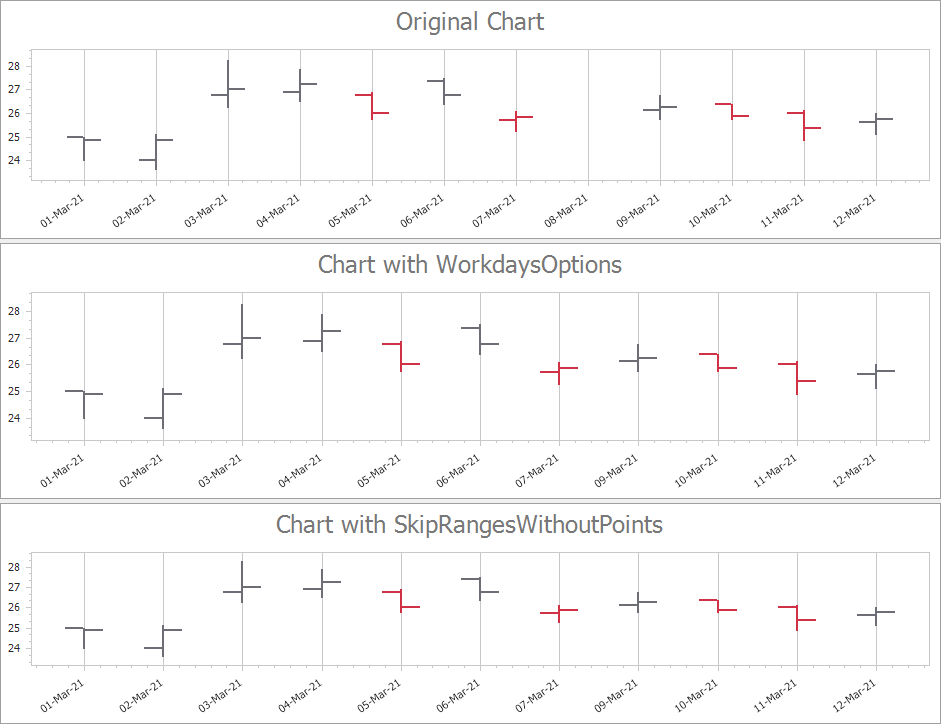

<!-- default file list -->
*Files to look at*:

* [Form1.cs](./CS/WeekendsExclusion/Form1.cs) (VB: [Form1.vb](./VB/WeekendsExclusion/Form1.vb))
<!-- default file list end -->
# Charts - How to exclude weekends and holidays from the axis range

This example demonstrates how you can exclude weekends and holidays from the X-axis range. This feature is useful for financial charting.

You can specify a custom week, or import holiday lists in Microsoft Outlook or in our native [XtraScheduler](https://docs.devexpress.com/WindowsForms/1729/controls-and-libraries/scheduler/visual-elements/scheduler-control) format.

The first chart excludes holidays and non-working days from the axis scale and shows how to set custom workdays and holidays. For this, use the [DateTimeScaleOptions.WorkdaysOnly](https://docs.devexpress.com/CoreLibraries/DevExpress.XtraCharts.DateTimeScaleOptions.WorkdaysOnly) and [DateTimeScaleOptions.WorkdaysOptions](https://docs.devexpress.com/CoreLibraries/DevExpress.XtraCharts.DateTimeScaleOptions.WorkdaysOptions) properties. In this example, Sunday is a working day and Saturday is a day off, 6th of March (Saturday) is an additional working day and 8th of March (Monday) is an additional holiday.

The second chart shows how to exclude axis ranges without data points. For his, you can use the [DateTimeScaleOptions.SkipRangesWithoutPoints](https://docs.devexpress.com/CoreLibraries/DevExpress.XtraCharts.DateTimeScaleOptions.SkipRangesWithoutPoints) property. In this example, 8th of March has no data points to display and is not displayed on the X-axis.

## Documentation

- [Work Time and Workday Configuration](https://docs.devexpress.com/WindowsForms/16474/controls-and-libraries/chart-control/data-representation/work-time-and-workday-configuration)
- [Financial Charting](https://docs.devexpress.com/WindowsForms/8946/controls-and-libraries/chart-control/data-representation/financial-charting)